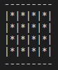
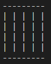
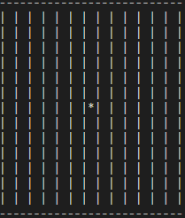
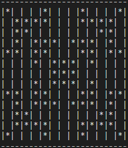

# Inputs de Ejemplo Tarea 1 SSOO

**_With love 💜 by KnowYourselves_**

## Aclaraciones generales

1. Este _input_ **no es el que será utilizado para la corrección de la tarea**.
2. El objetivo de este _input_ es **ayudarlos en su proceso de _debugging_**.
3. Cualquier duda, **envíen un correo o comuniquense conmigo**.

## Archivos

A continuación se describirán todos los archivos y su utilidad para el proceso de _debug_. Les recomiendo hacer todas las ejecuciones con `valgrind` ya que en todos estos casos no deberían tener ni errrores de memoria ni _leaks_.

### Comprobar Señales

En esta carpeta podrán encontrar un archivo `tableros.txt` y cuatro archivos de input. El tablero solo tiene una configuración que es un cuadrado y todos los inputs son tal que el tablero no va a cambiar durante el tiempo. Todos los archivos de input ejecutan el mismo proceso simulador que se demora mucho en ejecutar.

#### Comprobar time (Proceso Generador)

Para probar que los procesos generadores envian señal correctamente a sus procesos hijos cuando se les acaba el tiempo pueden probar ejecutando `./crvid time_X.txt 0`, con `X` siendo `small` o `big`.

En el caso de `small` es un proceso generador que solo tiene dos procesos simuladores como hijos y los va a interrumpir despues de un segundo. Deberían ver como output dos lineas con una cantidad de iteraciónes similar y ambas con `SIGNAL`.

En el caso de `big` son 5 procesos generadores cada uno con 3 hijos, dos simuladores y un generador. El primer proceso generador tiene 5 segundos para correr, el segundo 4 y así sucesivamente hasta que el último tiene 1. Lo que deberían ver como output es que los procesos simuladores fueron todos detenidos con `SIGNAL` y deberían tener una cantidad decreciente de iteraciones. Los dos simuladores hijos del primer generador tuvieron 5 segundos para correr, mientras los hijos del segundo generador tuvieron 4 segundos y así sucesivamente.

#### Comprobar ctrl+c (Proceso Generador + Proceso Simulador)

Para probar que los procesos generadores envian señal correctamente a sus procesos hijos cuando se les acaba el tiempo pueden probar ejecutando `./crvid ctrlc_X.txt 0`, con `X` siendo `small` o `big`.

Tanto `small` como `big` son los mismos archivos que para `time` solo que esta vez los procesos generadores tienen mil segundos para correr. Si hacen `CTRL + C` con cualquiera de estos archivos deberían ver que todos los procesos fueron detenidos con `SIGNAL` y tuvieron mas o menos la misma cantidad de iteraciones.

Para probar si la interrupción está funcionando para un proceso simulador pueden ejecutar `./crvid ctrlc_small.txt 1` e intentar interrumpir directamente a un proceso simulador.

### Comprobar Simulador

En esta carpeta encontraran un `tableros.txt` y muchos archivos de _input_. Cada archivo representa un caso especifico del juego de la vida. Hay algunos que formaran ciclos, otros que morirán después de una cantidad determinada de tiempo, otros que se moverán hasta desaparecer. Para esta parte les recomiendo implementar una forma de imprimir el tablero de simulación antes de cada iteración para comprobar que su programa esta evolucionando correctamente.

Finalmente, todos los archivos en este caso pueden ser ejecutados de la forma `./crvid archivo 0`.

#### Simuladores Estáticos

Estos son los casos más simples del juego de la vida, también conocidos como _still life_, son tableros que nunca cambian o que terminan estabilizandose en una configuración específico. Estos casos son `block.txt` y `bee_hive`. El comportamiento esperado es el siguiente:

|    Archivo     |      Estado Final      |
| :------------: | :--------------------: |
|  `block.txt`   |     |
| `bee_hive.txt` |  |

#### Simuladores Cíclicos

Hay algunas configuraciones que son cíclicas. Estos casos son `beacon.txt` y `penta_oscilator.txt`. El ciclo esperado es el siguiente:

|        Archivo        |          Movimiento           |
| :-------------------: | :---------------------------: |
|     `beacon.txt`      |           |
| `penta_oscilator.txt` |  |

#### Simuladores Móviles

El juego de la vida nos permite crear configuraciones que se muevan por el espacio como si fueran naves espaciales. Estos casos son `glider.txt` y `spaceship.txt`. Su movimiento esperado es el siguiente:

|     Archivo     |       Movimiento        |
| :-------------: | :---------------------: |
|  `glider.txt`   |     |
| `spaceship.txt` |  |

#### Casos Especiales

Todos los casos anteriormente descritos siguen las reglas _standard_ del juego de la vida. Los siguientes casos utilizan otros valores de `A`, `B` y `C` para producir patrones especificos. Estos casos son `decaimiento.txt` y `florecimiento.txt`. El comportamiento esperado es el siguiente:

|       Archivo       |          Estado Inicial          |           Estado Final            |
| :-----------------: | :------------------------------: | :-------------------------------: |
|  `decaimiento.txt`  |    |    |
| `florecimiento.txt` |  |  |
